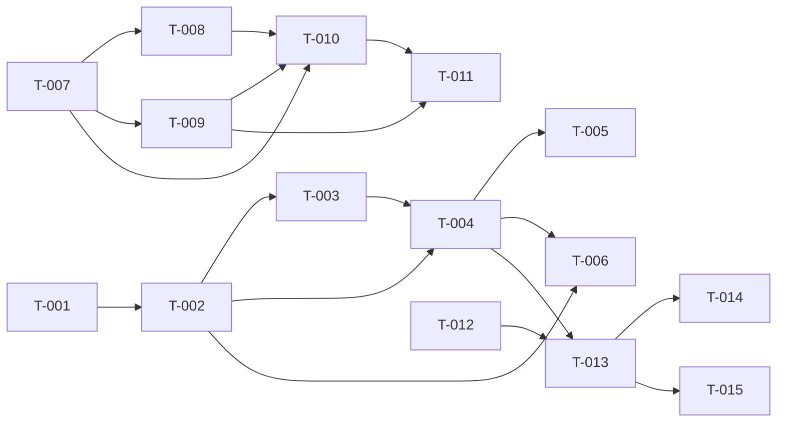

# Build Site: Folder Config, Sidebar Organization & Chat Seeding

The chat-folders-as-presets feature, decomposed across its three self.chat client
kits into 15 tasks over 6 dependency tiers. Backend (self.ai MR!138 preset-config
endpoint and the recent-chats unfoldered-only filter) is already shipped; every
task below is client-side work in this repo.

## Source Kits & Requirement Roll-Up

| Kit (short id) | File | Requirements | Acceptance Criteria |
|----------------|------|--------------|---------------------|
| **FC** — Folder RAG Config UI | cavekit-folder-rag-config-ui.md | R1–R6 (6) | 22 |
| **SO** — Sidebar Folder Chat Organization | cavekit-sidebar-folder-chat-organization.md | R1–R5 (5) | 21 |
| **CS** — Chat Creation Folder Seeding | cavekit-chat-creation-folder-seeding.md | R1–R4 (4) | 14 |
| | | **15 requirements** | **57 criteria** |

> **Count note.** The generating brief stated 51 acceptance criteria; the kits as
> written enumerate **57** (`- [ ]` checkboxes: FC 22, SO 21, CS 14). All 57 are
> mapped in the Coverage Matrix. Reported to keep the measurement honest.

## Cross-Domain Dependency Resolution (from cavekit-overview.md)

- **FC and SO are independent** — they cross-reference only for "the Configure
  entry point sits within the sidebar folder area," which is a placement note, not
  a build dependency. They build in parallel from Tier 0.
- **CS/R2 → FC/R4** (cross-domain, encoded as `T-013 blockedBy T-004`). See
  judgment note under the Task Register.
- **CS/R1 is NOT blocked by SO** — the seeding kit owns the new-chat affordance's
  placement; SO only governs where the resulting chat is displayed. `T-012` sits
  in Tier 0 with no SO blocker. See judgment note.
- **SO/R3 has no cross-repo blocker** — the self.ai recent-chats endpoint already
  returns unfoldered-only rows unconditionally; `cavekit-chat-list-unfoldered-filter`
  adds only regression tests, no new backend work. `T-009` depends solely on this
  repo's `T-007`.

---

## Task Register

Each task lists: Cavekit / Requirement / blockedBy / Effort / Description / Files /
Test Strategy. Effort: S (<30m), M (30m–2h), L (2h+).

### Domain FC — Folder RAG Config UI

#### T-001: Add "Configure" entry to the folder options menu
- **Cavekit:** cavekit-folder-rag-config-ui.md — **FC/R1**
- **Criteria mapped:** FC/R1 (all 3)
- **blockedBy:** none
- **Effort:** S
- **Description:** Add a "Configure" item to `FolderMenu.svelte` alongside the
  existing rename/export/delete items, following the same dispatch-only idiom
  (`dispatch('configure')`, then `dispatch('close')`; no direct action, no handler
  prop). In `RecursiveFolder.svelte`, add `on:configure` to the `<FolderMenu>`
  binding that flips a new bound boolean (mirror of `showDeleteConfirm`) to open
  the modal from T-002.
- **Files:** `src/lib/components/layout/Sidebar/Folders/FolderMenu.svelte`,
  `src/lib/components/layout/Sidebar/RecursiveFolder.svelte`
- **Test Strategy:** Vitest component test — mount `FolderMenu`, assert the
  Configure item renders and firing it dispatches `configure` and nothing else;
  assert `RecursiveFolder` opens the modal boolean on the event.

#### T-002: Build the folder-configuration modal composing existing pickers
- **Cavekit:** cavekit-folder-rag-config-ui.md — **FC/R2** (+ FC/R6 guard)
- **Criteria mapped:** FC/R2 (all 6); FC/R6-AC1 partially (reuse-only)
- **blockedBy:** T-001
- **Effort:** L
- **Description:** New `FolderConfigModal.svelte` whose visibility is a bound
  boolean (same idiom as the `ConfirmDialog` delete modal). Compose exactly three
  **existing** inputs, no new picker UI: (1) the chat composer's single-model
  picker primitive bound to one model id (the primitive, not the composer wrapper
  with its side effects); (2) the Workspace tool-set picker bound to a plain array
  of tool ids; (3) the Workspace Knowledge picker bound to full knowledge objects.
  Ensure the backing option data (models, tools, knowledge collections) is
  populated before/as the modal opens so every picker shows selectable options.
- **Files:** `src/lib/components/layout/Sidebar/Folders/FolderConfigModal.svelte`
  (new), `src/lib/components/layout/Sidebar/RecursiveFolder.svelte` (render + bind)
- **Test Strategy:** Vitest — mount the modal open, assert three pickers render
  with non-empty option sets; assert visibility follows the bound boolean; grep/
  import assertion that all three are pre-existing shared components (feeds T-006).
- **Design Ref:** none (DESIGN.md absent); match the delete-confirmation modal's
  existing visual idiom.

#### T-003: Pre-populate the modal from the folder's current preset
- **Cavekit:** cavekit-folder-rag-config-ui.md — **FC/R3**
- **Criteria mapped:** FC/R3 (all 3)
- **blockedBy:** T-002
- **Effort:** M
- **Description:** On open, read the folder's stored `meta.preset.{default_model_id,
  tool_ids, knowledge_ids}` and seed each picker's initial selection. A folder with
  no preset opens fully empty/unselected. A stored tool/knowledge reference that is
  present in the loaded option set appears pre-selected without the user re-picking
  it to preserve it on save.
- **Files:** `src/lib/components/layout/Sidebar/Folders/FolderConfigModal.svelte`,
  `src/lib/components/layout/Sidebar/RecursiveFolder.svelte` (pass folder object)
- **Test Strategy:** Vitest — open with a populated preset and assert each picker's
  initial value; open with `meta.preset` absent and assert all three empty; open
  with a preset ref that also exists in options and assert it renders pre-selected.

#### T-004: Persist the preset via a new folders-API function, single generic error
- **Cavekit:** cavekit-folder-rag-config-ui.md — **FC/R4**
- **Criteria mapped:** FC/R4 (all 4)
- **blockedBy:** T-002, T-003 · **external:** self.ai preset-config endpoint (shipped)
- **Effort:** M
- **Description:** Add a new function to `folders/index.ts` (no generic
  folder-update passthrough exists today — only the narrow single-purpose updates)
  that submits `default_model_id`, `tool_ids`, `knowledge_ids` to the shipped
  folder-update endpoint. Wire the modal's Save to call it. On success, close the
  modal (or signal success) — a subsequent read reflects exactly the submitted
  values. On rejection, surface **one** generic error; do not claim which reference
  failed or whether it was missing vs. inaccessible, and perform **no** per-field
  client-side reference validation that duplicates/contradicts the backend's atomic
  all-or-nothing check.
- **Files:** `src/lib/apis/folders/index.ts` (new fn),
  `src/lib/components/layout/Sidebar/Folders/FolderConfigModal.svelte` (Save handler)
- **Test Strategy:** Vitest — mock the endpoint: success path closes modal and the
  re-read preset equals the payload; rejection path renders a single generic error
  with no per-field detail. Assert no client-side reference-validation branch runs
  before submit.

#### T-005: Explicit clear submits emptied fields as cleared values
- **Cavekit:** cavekit-folder-rag-config-ui.md — **FC/R5**
- **Criteria mapped:** FC/R5 (all 4)
- **blockedBy:** T-004
- **Effort:** S
- **Description:** Ensure Save always submits all three preset fields together, so
  an emptied field is sent as an explicit empty value (not omitted). Removing the
  model, unchecking all tools, or removing all knowledge and saving each result in
  that field being cleared on the folder's stored preset on a subsequent read —
  distinct from the backend's merge-on-omit behavior used by other update paths
  (e.g. rename), which never touch preset fields.
- **Files:** `src/lib/components/layout/Sidebar/Folders/FolderConfigModal.svelte`,
  `src/lib/apis/folders/index.ts` (confirm payload always carries all three keys)
- **Test Strategy:** Vitest — for each field, populate then empty then save; assert
  the submitted payload carries the empty value (not an omitted key) and the re-read
  preset shows the field cleared.

#### T-006: YAGNI guard — no new picker/selector components
- **Cavekit:** cavekit-folder-rag-config-ui.md — **FC/R6**
- **Criteria mapped:** FC/R6 (both)
- **blockedBy:** T-002, T-004
- **Effort:** S
- **Description:** Verify the domain added no new model/tool/knowledge picker or
  selector component: the three inputs are the pre-existing shared components, and
  the only net-new client code is the Configure menu item (T-001), the modal
  container composing existing pickers (T-002/T-003), and the folders-API function
  (T-004). A verification/review task; produces no new runtime code.
- **Files:** review of the diff across T-001…T-005 (no new files beyond
  `FolderConfigModal.svelte` and the one API function)
- **Test Strategy:** Diff/import review — assert `FolderConfigModal.svelte` imports
  the composer single-model primitive and the Workspace tool/Knowledge pickers by
  path and defines no new picker; assert the folders-API diff is one added function.

### Domain SO — Sidebar Folder Chat Organization

#### T-007: Rename the sidebar section header "Chats" → "Folders"
- **Cavekit:** cavekit-sidebar-folder-chat-organization.md — **SO/R1**
- **Criteria mapped:** SO/R1 (both)
- **blockedBy:** none
- **Effort:** S
- **Description:** In `Sidebar.svelte`, change the collapsible `<Folder>` section
  header `name={$i18n.t('Chats')}` (the one carrying the `onAddLabel` "New Folder"
  add affordance) to `$i18n.t('Folders')`. The add affordance's label and action
  (`createFolder()`) are unchanged apart from sitting under the renamed header. Add
  the i18n key if needed.
- **Files:** `src/lib/components/layout/Sidebar.svelte`, i18n locale(s) if a new key
- **Test Strategy:** Vitest/Cypress — assert the header renders "Folders" and the
  add affordance still triggers new-folder creation.

#### T-008: Scope the collapse toggle to the folder tree only
- **Cavekit:** cavekit-sidebar-folder-chat-organization.md — **SO/R2**
- **Criteria mapped:** SO/R2 (all 4)
- **blockedBy:** T-007
- **Effort:** M
- **Description:** Today the single "Chats"/"Folders" collapsible wraps pinned
  chats, the `<Folders>` tree, and the flat time-grouped list, so collapsing hides
  all three. Restructure so the header's collapse controls **only** the `<Folders>`
  tree: move the pinned-chats block and the flat list outside the collapsible's
  gated region so they stay visible regardless of collapse state. Preserve the
  existing collapse-state persistence (same localStorage mechanism the section uses
  today) across reload.
- **Files:** `src/lib/components/layout/Sidebar.svelte`,
  `src/lib/components/common/Folder.svelte` (if collapse gating boundary changes)
- **Test Strategy:** Vitest/Cypress — collapse the header and assert the folder tree
  hides while pinned chats and the flat list remain visible; reload and assert the
  collapsed state persists.

#### T-009: Regression-guard the flat list's server-side unfoldered-only scoping
- **Cavekit:** cavekit-sidebar-folder-chat-organization.md — **SO/R3**
- **Criteria mapped:** SO/R3 (all 5)
- **blockedBy:** T-007 · **external:** none (self.ai recent-chats already filters
  `folder_id IS NULL` unconditionally — regression guard on existing behavior only)
- **Effort:** M
- **Description:** Lock in as tested contract that the flat time-grouped list shows
  only chats with no folder, that a foldered chat never appears there, that the
  scoping comes from the server-side recent-chats response and **not** a client-side
  post-filter over a broader set, and that existing time grouping (Today, Yesterday,
  Previous 7/30 days, month names) and pagination/infinite-scroll are preserved.
- **Files:** `test/`/`cypress/` new specs; `src/lib/components/layout/Sidebar.svelte`
  (assert it renders the endpoint response without a broadening post-filter)
- **Test Strategy:** Cypress e2e + Vitest — assert flat list contains only
  unfoldered chats and a foldered chat is absent; assert grouping headers and
  load-more behavior persist; assert the client does not fetch-all-then-filter.

#### T-010: No-regression coverage for existing folder behavior
- **Cavekit:** cavekit-sidebar-folder-chat-organization.md — **SO/R4**
- **Criteria mapped:** SO/R4 (all 7)
- **blockedBy:** T-007, T-008, T-009
- **Effort:** M
- **Description:** After the header rename and collapse re-scope, verify all
  existing folder behavior still works: drag a chat onto a folder moves it; drag a
  folder onto another/root reparents it; rename, export, and delete-subtree work as
  before; a folder's own expanded/collapsed state persists across reload; and a
  folder still renders its own contained chats when expanded (pre-existing, must
  remain unaltered).
- **Files:** `cypress/` regression specs against `Sidebar.svelte`,
  `RecursiveFolder.svelte`, `Folders.svelte`
- **Test Strategy:** Cypress e2e regression suite covering each of the seven
  behaviors; run after T-008/T-009 land to catch restructure regressions.

#### T-011: Move-into-folder removes chat from the flat list (and reverse)
- **Cavekit:** cavekit-sidebar-folder-chat-organization.md — **SO/R5**
- **Criteria mapped:** SO/R5 (all 3)
- **blockedBy:** T-009, T-010
- **Effort:** M
- **Description:** Assert the observable consequence of T-009's server-side scoping
  plus the folder tree's pre-existing per-folder rendering: after a chat is dragged
  into a folder it disappears from the flat unfoldered list and appears under that
  folder when expanded; dragging it back out to the unfoldered area returns it to
  the flat list. No new code path beyond the existing filter — behavior test only.
- **Files:** `cypress/` spec exercising drag-in / expand / drag-out
- **Test Strategy:** Cypress e2e — drag a chat into a folder, assert removal from
  flat list and appearance under the expanded folder; drag out, assert reappearance.

### Domain CS — Chat Creation Folder Seeding

#### T-012: Add a per-folder "new chat" affordance
- **Cavekit:** cavekit-chat-creation-folder-seeding.md — **CS/R1**
- **Criteria mapped:** CS/R1 (all 3)
- **blockedBy:** none (this kit owns the affordance placement — see judgment note)
- **Effort:** M
- **Description:** Add a user-reachable affordance to create a new chat with a
  specific folder as the active context (this kit decides placement — e.g. a "New
  Chat" item in `FolderMenu.svelte` and/or a per-folder action in
  `RecursiveFolder.svelte`). The created chat belongs to that folder — it appears
  under the folder when expanded, not in the flat unfoldered list — and the flow
  does not require creating an unfoldered chat and manually moving it.
  *Coordination note:* touches `FolderMenu.svelte`, the same file as T-001; not a
  build dependency, but land order/merge should be coordinated to avoid conflict.
- **Files:** `src/lib/components/layout/Sidebar/Folders/FolderMenu.svelte`,
  `src/lib/components/layout/Sidebar/RecursiveFolder.svelte`, new-chat navigation
  wiring (route/store that sets the active folder context)
- **Test Strategy:** Cypress e2e — invoke the affordance on a folder, assert a new
  chat is created belonging to that folder (appears under it, absent from flat list)
  without an intermediate unfoldered-then-move step.

#### T-013: Seed a folder-scoped new chat from the folder's preset
- **Cavekit:** cavekit-chat-creation-folder-seeding.md — **CS/R2**
- **Criteria mapped:** CS/R2 (all 4)
- **blockedBy:** T-012, **T-004** (cross-domain — the write path that establishes a
  persisted preset to read; see judgment note)
- **Effort:** L
- **Description:** When a chat is created with a folder as active context,
  initialize its selected model from the preset's `default_model_id`, its selected
  tools from `tool_ids` (filtered to tools that currently exist, mirroring the
  existing model-metadata tool-seeding pattern), and its attached knowledge from
  `knowledge_ids` as the chat's knowledge/collection attachments. Seeding reads the
  same `meta.preset.{default_model_id, tool_ids, knowledge_ids}` shape the config
  modal (T-004) writes.
- **Files:** chat-creation flow (new-chat initialization component/store that reads
  the active folder's preset and sets `selectedModels` / selected tool ids /
  knowledge attachments)
- **Test Strategy:** Cypress e2e + Vitest — create a chat in a folder whose preset
  sets model/tools/knowledge; assert the opened chat has that model selected, those
  tools selected (nonexistent ones filtered out), and that knowledge attached;
  assert the read path uses the `meta.preset` shape.

#### T-014: Empty/partial preset seeds nothing beyond unfoldered defaults
- **Cavekit:** cavekit-chat-creation-folder-seeding.md — **CS/R3**
- **Criteria mapped:** CS/R3 (all 3)
- **blockedBy:** T-013
- **Effort:** S
- **Description:** Seeding is a plain no-op per unset field — no special "empty
  folder" branch. A chat created in a folder with no preset selects the same model,
  tools, and knowledge an unfoldered new chat would. A partially-set preset (e.g.
  model set, no tools) seeds only the set fields and leaves the rest at unfoldered
  defaults.
- **Files:** same chat-creation initialization path as T-013
- **Test Strategy:** Vitest/Cypress — create in an empty-preset folder and assert
  identical initial state to an unfoldered new chat; create in a partial-preset
  folder and assert only set fields differ from the unfoldered baseline.

#### T-015: Seeded settings are independent per-chat state
- **Cavekit:** cavekit-chat-creation-folder-seeding.md — **CS/R4**
- **Criteria mapped:** CS/R4 (all 4)
- **blockedBy:** T-013
- **Effort:** M
- **Description:** After creation the seeded model/tools/knowledge are ordinary
  per-chat mutable settings. Changing the model, toggling a tool, or detaching/
  attaching knowledge in a folder-seeded chat must not mutate the folder's stored
  preset, and the folder must never re-apply its preset after creation (a chat with
  changed settings keeps the changes). No hard-binding, no desync tracking.
- **Files:** verification against the chat-settings mutation paths and the folders
  store/API (assert no write-back to `meta.preset` on chat-setting changes)
- **Test Strategy:** Cypress e2e — in a seeded chat, change model/tool/knowledge;
  re-read the folder preset and assert it is unchanged; reload/re-open the chat and
  assert changed settings persist (folder did not re-assert).

---

## Dependency Tiers

### Tier 0 — No Dependencies (Start Here)
| Task | Title | Cavekit | Req | Effort |
|------|-------|---------|-----|--------|
| T-001 | Add "Configure" entry to folder options menu | cavekit-folder-rag-config-ui.md | FC/R1 | S |
| T-007 | Rename section header "Chats" → "Folders" | cavekit-sidebar-folder-chat-organization.md | SO/R1 | S |
| T-012 | Add per-folder "new chat" affordance | cavekit-chat-creation-folder-seeding.md | CS/R1 | M |

### Tier 1 — Depends on Tier 0
| Task | Title | Cavekit | Req | blockedBy | Effort |
|------|-------|---------|-----|-----------|--------|
| T-002 | Build folder-configuration modal (compose pickers) | cavekit-folder-rag-config-ui.md | FC/R2 | T-001 | L |
| T-008 | Scope collapse toggle to folder tree only | cavekit-sidebar-folder-chat-organization.md | SO/R2 | T-007 | M |
| T-009 | Regression-guard server-side unfoldered scoping | cavekit-sidebar-folder-chat-organization.md | SO/R3 | T-007 | M |

### Tier 2 — Depends on Tier 1
| Task | Title | Cavekit | Req | blockedBy | Effort |
|------|-------|---------|-----|-----------|--------|
| T-003 | Pre-populate modal from folder's current preset | cavekit-folder-rag-config-ui.md | FC/R3 | T-002 | M |
| T-010 | No-regression coverage for existing folder behavior | cavekit-sidebar-folder-chat-organization.md | SO/R4 | T-007, T-008, T-009 | M |

### Tier 3 — Depends on Tier 2
| Task | Title | Cavekit | Req | blockedBy | Effort |
|------|-------|---------|-----|-----------|--------|
| T-004 | Persist preset via folders-API, single generic error | cavekit-folder-rag-config-ui.md | FC/R4 | T-002, T-003 | M |
| T-011 | Move-into-folder removes chat from flat list | cavekit-sidebar-folder-chat-organization.md | SO/R5 | T-009, T-010 | M |

### Tier 4 — Depends on Tier 3
| Task | Title | Cavekit | Req | blockedBy | Effort |
|------|-------|---------|-----|-----------|--------|
| T-005 | Explicit clear submits emptied fields as cleared | cavekit-folder-rag-config-ui.md | FC/R5 | T-004 | S |
| T-006 | YAGNI guard — no new picker components | cavekit-folder-rag-config-ui.md | FC/R6 | T-002, T-004 | S |
| T-013 | Seed folder-scoped new chat from preset | cavekit-chat-creation-folder-seeding.md | CS/R2 | T-012, T-004 | L |

### Tier 5 — Depends on Tier 4
| Task | Title | Cavekit | Req | blockedBy | Effort |
|------|-------|---------|-----|-----------|--------|
| T-014 | Empty/partial preset seeds nothing extra | cavekit-chat-creation-folder-seeding.md | CS/R3 | T-013 | S |
| T-015 | Seeded settings are independent per-chat state | cavekit-chat-creation-folder-seeding.md | CS/R4 | T-013 | M |

## Dependency Graph

The only cross-domain edge is `T-004 --> T-013` (FC preset write path → CS seeding
read). All three domains open in parallel at Tier 0. Acyclic (verified: every edge
points strictly from a lower to a higher tier).

## Summary

- **Tasks:** 15 (FC 6, SO 5, CS 4 — one task per requirement; clean 1:1 mapping)
- **Tiers:** 6 (Tier 0 → Tier 5)
- **Parallelism:** three independent chains (FC, SO, CS) join only at `T-004→T-013`.
  Tier 0 offers 3 immediately-startable tasks (T-001, T-007, T-012).
- **Effort mix:** S ×5, M ×8, L ×2 (T-002 modal, T-013 seeding — the two largest
  tasks). No task exceeds the L threshold requiring a split.
- **External dependencies:** both already shipped in self.ai — the preset-config
  folder-update endpoint (consumed by T-004) and the recent-chats unfoldered-only
  filter (relied on, tested by T-009). No new backend work blocks this site.

### Cross-domain judgment calls

- **CS/R2 blocked by FC/R4 specifically (T-013 ← T-004), not the whole FC domain.**
  The `meta.preset.{default_model_id, tool_ids, knowledge_ids}` shape that seeding
  reads is backend-defined and stable; T-004 is the minimal frontend task that
  produces a *persisted* preset to seed from and to write e2e test fixtures
  against. T-005 (explicit clear) and T-006 (YAGNI review) do not alter that shape,
  so blocking T-013 on the entire domain would serialize unrelated work. Minimal
  correct blocker = T-004.
- **CS/R1 (T-012) not blocked by any SO task.** Per the resolved cross-reference,
  the seeding kit owns the new-chat affordance's placement; SO only governs where
  the resulting chat is displayed. Adding an SO blocker would be a false dependency
  that serializes parallelizable Tier-0 work. Kept independent. Noted only that
  T-012 edits `FolderMenu.svelte` — the same file as T-001 — so their land order is
  a merge-coordination concern, not a build ordering one.

## Coverage Matrix

Every acceptance criterion across all three kits (57 total) mapped to at least one
task. **Coverage: 57/57 = 100%.**

| Kit | Req | Criterion (abbrev.) | Task(s) |
|-----|-----|---------------------|---------|
| FC | R1 | Configure item alongside rename/export/delete | T-001 |
| FC | R1 | Selecting dispatches `configure`, no other action | T-001 |
| FC | R1 | Owning folder listens, opens modal | T-001 |
| FC | R2 | Visibility = bound boolean (delete-modal idiom) | T-002 |
| FC | R2 | Single default-model picker primitive | T-002 |
| FC | R2 | Workspace tool-set picker (array of ids) | T-002 |
| FC | R2 | Workspace Knowledge picker (full objects) | T-002 |
| FC | R2 | Backing option data populated before/as open | T-002 |
| FC | R2 | No new picker/selector introduced | T-002, T-006 |
| FC | R3 | Loads preset, reflects each picker's initial value | T-003 |
| FC | R3 | No preset → all three empty/unselected | T-003 |
| FC | R3 | Stored ref in option set appears pre-selected | T-003 |
| FC | R4 | New folders-API fn submits the three fields | T-004 |
| FC | R4 | Success closes modal; preset = submitted values | T-004 |
| FC | R4 | Rejection → single generic error, no field detail | T-004 |
| FC | R4 | No duplicating per-field client validation | T-004 |
| FC | R5 | Remove model + save → no default model stored | T-005 |
| FC | R5 | Uncheck all tools + save → no tools stored | T-005 |
| FC | R5 | Remove all knowledge + save → no knowledge stored | T-005 |
| FC | R5 | Save submits all three fields (empty ≠ omitted) | T-005 |
| FC | R6 | No new model/tool/knowledge picker component | T-006 |
| FC | R6 | Net-new code = menu item + modal + API fn only | T-006 |
| SO | R1 | Header previously "Chats" now reads "Folders" | T-007 |
| SO | R1 | Add affordance still creates a new folder | T-007 |
| SO | R2 | Collapsing "Folders" hides the folder tree | T-008 |
| SO | R2 | Collapsing does NOT hide pinned-chats section | T-008 |
| SO | R2 | Collapsing does NOT hide flat unfoldered list | T-008 |
| SO | R2 | Collapse state persists across reload | T-008 |
| SO | R3 | Flat list contains only unfoldered chats | T-009 |
| SO | R3 | A foldered chat does not appear in flat list | T-009 |
| SO | R3 | Time-range grouping preserved | T-009 |
| SO | R3 | Pagination / infinite-scroll preserved | T-009 |
| SO | R3 | Scoping from server response, not client post-filter | T-009 |
| SO | R4 | Drag chat onto folder still moves it in | T-010 |
| SO | R4 | Drag folder onto folder/root still reparents | T-010 |
| SO | R4 | Renaming a folder still works | T-010 |
| SO | R4 | Exporting a folder still works | T-010 |
| SO | R4 | Deleting a folder + subtree still works | T-010 |
| SO | R4 | Folder expand/collapse state persists across reload | T-010 |
| SO | R4 | Folder renders own contained chats when expanded | T-010 |
| SO | R5 | After drag-in, chat gone from flat list | T-011 |
| SO | R5 | After drag-in, chat appears under expanded folder | T-011 |
| SO | R5 | After drag-out, chat reappears in flat list | T-011 |
| CS | R1 | Affordance to create chat with folder context exists | T-012 |
| CS | R1 | Created chat belongs to that folder (not flat list) | T-012 |
| CS | R1 | No create-unfoldered-then-move requirement | T-012 |
| CS | R2 | Preset model → chat opens with that model selected | T-013 |
| CS | R2 | Preset tools → selected, filtered to existing | T-013 |
| CS | R2 | Preset knowledge → attached to the chat | T-013 |
| CS | R2 | Reads `meta.preset.{...}` shape modal writes | T-013 |
| CS | R3 | No preset → same model as unfoldered new chat | T-014 |
| CS | R3 | No preset → no tools/knowledge beyond unfoldered | T-014 |
| CS | R3 | Partial preset seeds only set fields | T-014 |
| CS | R4 | Changing model doesn't change folder preset | T-015 |
| CS | R4 | Toggling tool doesn't change folder preset | T-015 |
| CS | R4 | Detach/attach knowledge doesn't change preset | T-015 |
| CS | R4 | Folder never re-applies preset after creation | T-015 |
