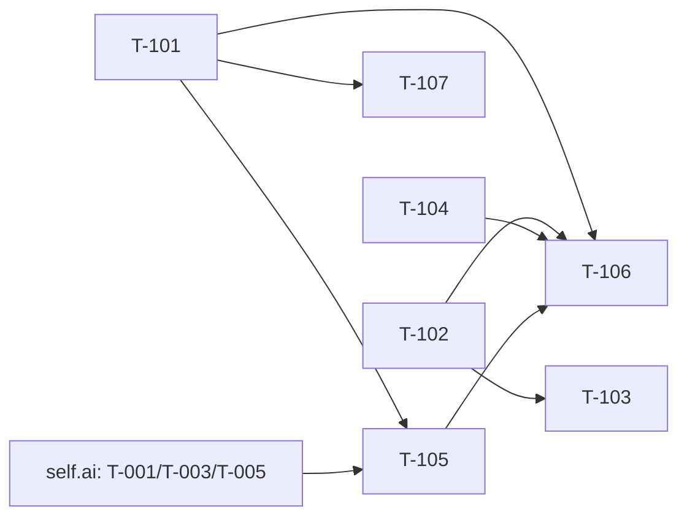

# Build Site: Workspace → Studio Rename (self.chat)

Phase 0 of the Tokenization Studio programme, client half. Renames the
product surface **Workspace** to **Studio** across routes, the component tree,
navigation and 51 locales. No redirects — old URLs stop existing.

**Hard prerequisite:** `self.ai`'s `build-site-studio-rename-permissions.md`
must land first, or at latest in the same release. T-105 below cannot ship
before it: without the backend migration and dual-read, every non-admin loses
every Studio section the moment this deploys, with no error and no log line.

**Out of scope, strictly:** any behavioural change to a renamed page. If a
Workspace page is broken today it is equally broken as a Studio page
afterwards. A rename MR that also fixes things cannot be reviewed.

Decision record: `selfai/gitlab-profile`
`context/treasuremaps/2026-08-11-tokenization-studio.md`, Decision 1.

## Source Kits & Requirement Roll-Up

| Kit (short id) | File | Requirements | Acceptance Criteria |
|----------------|------|--------------|---------------------|
| **SR** — Studio Rename | cavekit-studio-rename.md | R1–R6 (6) | 24 |

## Grounding corrections to the kit

Measured in this repo at `context/cavekit-tokenization-studio`. Four of the
kit's numbers differ from what is actually there; two of them change the work.

1. **Eight sub-sections, not seven.** The kit lists `models`, `knowledge`,
   `prompts`, `tools`, `voices`, `training`, `evaluations`. There is also
   **`functions/`**, and it is a stub: `functions/create/+page.svelte` exists
   with **no index page and no `Functions.svelte` component**. It is an
   orphaned route reachable only by typing the URL. It renames with everything
   else and is **not** deleted here — deleting it would be a behavioural change
   in a rename MR. Named as duct tape in T-107.

2. **The measured surface depends on what you count.** The kit says 62 files /
   178 occurrences. Restricted to `src/**` `.svelte`/`.ts`/`.js`, it is
   **55 files / 157 occurrences**; the remainder are locale JSON and config.
   Both are right for their scope. T-106's guard should assert on the renamed
   *directories*, not on a global count, which drifts.

3. **Two locales are missing the `Workspace` key entirely.** 51 locale
   directories exist; **49** contain `"Workspace":`. The kit's R4-AC2 says all
   51 must carry the renamed key — but two of them never carried the old one.
   The rule this site adopts: a locale that lacked the key still lacks it
   afterwards and falls through to `en-US` as it does today. Adding it to those
   two would be a translation change, not a rename. See T-104.

4. **`en-US` values are empty strings.** `"Workspace": ""` — this repo's
   `en-US` uses the key as the display string and leaves the value blank. So
   renaming the key *is* renaming the visible English label; there is no
   `en-US` value to edit. Non-English locales do carry real values and those
   are carried across unmodified.

Also measured: the sidebar gate at `Sidebar.svelte:556` reads five permission
sub-keys (`models`, `knowledge`, `prompts`, `training`, `tools`) while
`+layout.svelte` gates seven (adding `evaluations`, `voices`) — a pre-existing
inconsistency that is preserved verbatim, not reconciled.

## Task Register

Effort: S (<30m), M (30m–2h), L (2h+). Task ids are T-1xx to keep them
distinct from `build-site-folder-config.md`'s T-0xx in shared conversation.

#### T-101: Move the 21 route files to `/studio`
- **Cavekit:** cavekit-studio-rename.md — **SR/R1**
- **Criteria mapped:** SR/R1 (all 5)
- **blockedBy:** none
- **Effort:** M
- **Description:** `git mv src/routes/(app)/workspace src/routes/(app)/studio`,
  preserving the full sub-structure: `+layout.svelte`, `+page.svelte` and the
  eight sub-sections `evaluations`, `functions`, `knowledge` (with `create`,
  `dataset`, `dataset/create`, `[id]`), `models` (`create`, `edit`), `prompts`
  (`create`, `edit`), `tools` (`create`, `edit`), `training`, `voices`
  (`create`, `[id]`). Use `git mv` so history follows. Add **no** redirect from
  any `/workspace/...` path — Decision 1 drops them deliberately; an earlier
  draft of the kit specified them. Then update every in-app link that points at
  a `/workspace/...` path: with nothing redirecting, a missed link is a dead
  one.
- **Files:** all 21 files under `src/routes/(app)/workspace/` → `studio/`;
  every `goto`/`href`/`resolve` call site naming a workspace path
- **Test Strategy:** Cypress e2e — visit each of the eight sub-section routes
  under `/studio` and assert it renders what its `/workspace` predecessor
  rendered; assert `/workspace/models` now 404s rather than redirecting. Vitest
  — assert no `resolve`/`href` string in `src/` contains `/workspace`.

#### T-102: Move the component tree and fix every import
- **Cavekit:** cavekit-studio-rename.md — **SR/R2**
- **Criteria mapped:** SR/R2 (all 5)
- **blockedBy:** none (independent of T-101 — different tree)
- **Effort:** M
- **Description:** `git mv src/lib/components/workspace
  src/lib/components/studio`, carrying `common/`, the seven `*.svelte` section
  files and the `Knowledge/`, `Models/`, `Tools/`, `Voices/` subdirectories.
  Update every import of `$lib/components/workspace/`, including the three
  known external sites — `layout/Sidebar/ChannelModal.svelte:11`
  (`common/AccessControl.svelte`) and
  `layout/Sidebar/Folders/FolderConfigModal.svelte:21-22`
  (`Models/ToolsSelector.svelte`, `Models/Knowledge.svelte`) — plus any further
  site a repo-wide search surfaces.
- **Files:** everything under `src/lib/components/workspace/`; all importers
- **Test Strategy:** Vitest — assert no file in `src/` contains the fragment
  `$lib/components/workspace/`. `npm run lint` and the type check report no
  unresolved imports. Local lint is fine; full validation goes through CI on
  purpose.

#### T-103: Update the two path-asserting tests
- **Cavekit:** cavekit-studio-rename.md — **SR/R2-AC4**
- **Criteria mapped:** SR/R2-AC4
- **blockedBy:** T-102
- **Effort:** S
- **Description:** `FolderConfigModal.test.ts:412-413` and
  `folder-config-yagni.test.ts:17-18` both assert
  `expect(src).toContain('$lib/components/workspace/Models/…')` against file
  source. They fail on T-102 **by design** — they are the tripwire proving the
  sweep reached the importers. Update both to the `studio/` path. Do not
  weaken either assertion into a regex or a substring that would stop failing
  on a future move; their strictness is the feature.
- **Files:** `FolderConfigModal.test.ts`, `folder-config-yagni.test.ts`
- **Test Strategy:** both suites pass; deliberately re-break one path locally
  to confirm the assertion still fails.

#### T-104: Rename the i18n keys across every locale that has them
- **Cavekit:** cavekit-studio-rename.md — **SR/R4**
- **Criteria mapped:** SR/R4 (all 4)
- **blockedBy:** none
- **Effort:** M
- **Description:** Rename the affected keys — `"Workspace"`,
  `"Workspace Permissions"`, `"Workspaces"`, and the sentence keys that embed
  the word (`translation.json:113` "…assigned per model in the workspace.",
  and the two `" workspace first."` fragments at `:1009-1010`) — to their
  `Studio` equivalents. In `en-US` the values are empty strings and the key
  *is* the visible label, so renaming the key renames the English UI. In the
  **49** locales that carry a translated value, carry that value across
  unmodified — retranslating the word is out of scope. The **2** locales that
  never had the key do not gain it; they fall through to `en-US` exactly as
  today (see grounding correction 3). Run the i18n parser
  (`i18next-parser.config.ts`) and confirm no orphaned `workspace` key remains.
- **Files:** `src/lib/i18n/locales/*/translation.json` (49 of 51)
- **Test Strategy:** Vitest — assert `en-US` has no `Workspace`-bearing key;
  assert every locale that previously had the old key now has the new one and
  none has both; assert non-English values are unchanged strings, not reverted
  to English.

#### T-105: Client-side permission keys read `studio.*`
- **Cavekit:** cavekit-studio-rename.md — **SR/R5**
- **Criteria mapped:** SR/R5 (all 4)
- **blockedBy:** T-101 · **external, hard:** `self.ai`
  `build-site-studio-rename-permissions.md` T-001, T-003, T-005
- **Effort:** M
- **Description:** Change every `$user?.permissions?.workspace?.<x>` read to
  `?.studio?.<x>` across the measured sites: `Sidebar.svelte:556` (five
  sub-keys), `studio/+page.svelte:9-19` (six branches), and
  `studio/+layout.svelte:24-50` plus `:93-165` (seven guards and seven nav
  entries). Change the admin Groups editor's writes at
  `admin/Users/Groups/Permissions.svelte:126, 270, 284, 291, 298, 315` to bind
  `permissions.studio.*` — these **write** the blob, so they must match the
  backend's renamed Pydantic field (self.ai T-005) or an admin save will
  silently write a key nothing reads. Preserve the existing sidebar-vs-layout
  sub-key inconsistency verbatim; reconciling it is a behavioural change.
- **Files:** `src/lib/components/layout/Sidebar.svelte`,
  `src/routes/(app)/studio/+page.svelte`,
  `src/routes/(app)/studio/+layout.svelte`,
  `src/lib/components/admin/Users/Groups/Permissions.svelte`
- **Test Strategy:** Cypress e2e — a user in a **migrated** group sees exactly
  the sections they saw as Workspace sections; a user in a **deliberately
  unmigrated** group still sees them, via the backend dual-read (this is the
  case that proves the cross-repo contract, so it must use a real unmigrated
  fixture, not a mock); an admin sees all sections regardless of blob state.
  Vitest — the Groups editor submits a `studio`-shaped payload.

#### T-106: Rename completeness guard
- **Cavekit:** cavekit-studio-rename.md — **SR/R6**
- **Criteria mapped:** SR/R6 (all 3)
- **blockedBy:** T-101, T-102, T-104, T-105
- **Effort:** S
- **Description:** A test asserting no file under `src/routes/(app)/studio/` or
  `src/lib/components/studio/` contains the identifier `workspace`. With R1
  adding no redirects there is no legitimate remaining occurrence, so the test
  allows **no exemptions**. Its failure message names the treasuremap, so a
  contributor who trips it learns why rather than deleting the guard. Assert on
  the two renamed directories rather than on a repo-wide occurrence count,
  which drifts (grounding correction 2).
- **Files:** `src/lib/.../studio-rename-complete.test.ts` (new)
- **Test Strategy:** the test is the deliverable. Verify it fails by
  reintroducing the string in a scratch file under one of the guarded
  directories.

#### T-107: Name the orphaned `functions/` route, do not delete it
- **Cavekit:** none — arises from grounding correction 1
- **Criteria mapped:** none (closes no acceptance criterion)
- **blockedBy:** T-101
- **Effort:** S
- **Description:** `studio/functions/create/+page.svelte` has no index page and
  no backing `Functions.svelte`; nothing links to it. It is dead surface
  carried across by the move. **Do not delete it here** — removal is a
  behavioural change and this MR must stay reviewable as a pure rename. File an
  issue against `self.chat` describing the orphan and decide its fate
  separately. Duct tape made visible, per the repo's working rules.
- **Files:** one new GitLab issue; no code change
- **Test Strategy:** none.

## Dependency Tiers

### Tier 0 — No dependencies (start here)
| Task | Title | Req | Effort |
|------|-------|-----|--------|
| T-101 | Move the 21 route files | SR/R1 | M |
| T-102 | Move the component tree, fix imports | SR/R2 | M |
| T-104 | Rename i18n keys across locales | SR/R4 | M |

### Tier 1
| Task | Title | Req | blockedBy | Effort |
|------|-------|-----|-----------|--------|
| T-103 | Update the two path-asserting tests | SR/R2 | T-102 | S |
| T-105 | Client permission keys → `studio.*` | SR/R5 | T-101 + self.ai site | M |
| T-107 | Name the orphaned `functions/` route | — | T-101 | S |

### Tier 2
| Task | Title | Req | blockedBy | Effort |
|------|-------|-----|-----------|--------|
| T-106 | Rename completeness guard | SR/R6 | T-101, T-102, T-104, T-105 | S |

**SR/R3 (navigation and visible labels)** is not a task of its own: AC1 is
covered by T-101's link sweep, AC2 and AC3 by T-104's key rename (the sidebar
label is `$i18n.t('Workspace')`, so it renames with the key, not by a
hardcoded edit), and AC4 is a no-op assertion that the section labels inside
Studio are left alone. Mapped in the Coverage Matrix; folding it into a
seventh task would create a phantom edit.

## Dependency Graph

Acyclic. Three independent moves open in parallel at Tier 0; the only external
edge is the one that matters.

## Summary

- **Tasks:** 7 (6 kit requirements, one of which is covered without its own
  task, + 1 duct-tape note)
- **Tiers:** 3
- **Effort mix:** S ×3, M ×4. No L — the rename is wide, not deep.
- **Cross-repo:** T-105 is hard-blocked on `self.ai`. Nothing else here is.
- **Land order within the MR:** T-101/T-102/T-104 are pure moves and can be one
  commit each, keeping the diff reviewable as renames rather than rewrites. Use
  `git mv` throughout so review tooling shows moves, not 21 deletions and 21
  additions.

## Coverage Matrix

24 acceptance criteria across SR/R1–R6. **Coverage: 24/24 = 100%.**

| Req | Criterion (abbrev.) | Task(s) |
|-----|---------------------|---------|
| R1 | Every route file exists under `/studio`, structure preserved | T-101 |
| R1 | No route file remains under `/workspace` | T-101 |
| R1 | No redirect from any `/workspace/...` path | T-101 |
| R1 | Every in-app link points at the `/studio` equivalent | T-101 |
| R1 | `/studio/...` renders identically to its predecessor | T-101 |
| R2 | `components/workspace/` gone; contents at `components/studio/` | T-102 |
| R2 | No file contains `$lib/components/workspace/` | T-102 |
| R2 | The known external import sites resolve | T-102 |
| R2 | The two path-asserting tests updated and passing | T-103 |
| R2 | Lint + type check report no unresolved imports | T-102 |
| R3 | `Sidebar.svelte`'s resolve targets the studio route | T-101 |
| R3 | Sidebar label renders "Studio" via i18n, not hardcoded | T-104 |
| R3 | No user-visible string reads "Workspace" | T-104 |
| R3 | Section labels within Studio unchanged | T-104 |
| R4 | Each affected key renamed in `en-US` | T-104 |
| R4 | Every locale carrying the old key carries the new one | T-104 |
| R4 | Non-English values carried across unmodified | T-104 |
| R4 | i18n parser reports no orphaned `workspace` key | T-104 |
| R5 | Every client permission check reads `studio.` | T-105 |
| R5 | Migrated group sees the same sections | T-105 |
| R5 | Unmigrated group still sees them via the dual-read | T-105 |
| R5 | Admin sees all sections regardless of blob state | T-105 |
| R6 | No `workspace` identifier under the renamed directories | T-106 |
| R6 | No exemptions allowed | T-106 |
| R6 | Failure message names the treasuremap | T-106 |
