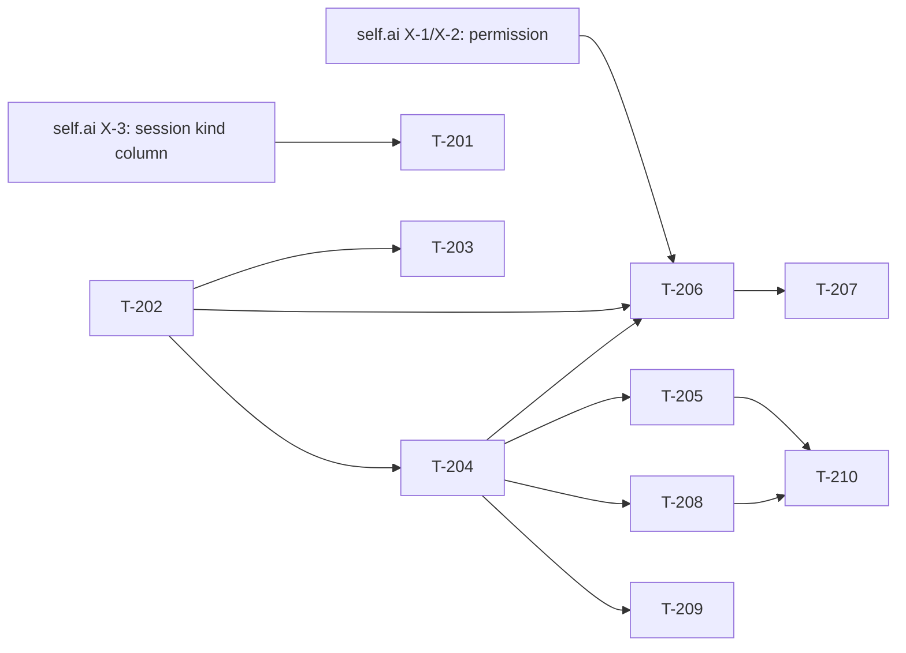

# Build Site: Tokenization Studio Shell (self.chat)

Phase 2 of the Tokenization Studio programme. Adds `/studio/tokenization`: a
model gallery that routes into a tokenization session rather than into chat, and
the session page itself — a fork of the chat page with the controls rail pinned
open on wide viewports.

With this site alone a tokenization session **looks and behaves like ordinary
chat**. That is the correct intermediate state and is independently shippable;
the token rendering lands on top of it in Phase 3.

Decision record: `selfai/gitlab-profile`
`context/treasuremaps/2026-08-11-tokenization-studio.md`, Decisions 2, 8, 9, 11.

**Prerequisite, already met:** Phase 0 (the Studio rename) is live —
`api:f75b0400` and `self.chat:8c3b6a1a`.

## Source Kits & Requirement Roll-Up

| Kit (short id) | File | Requirements | Acceptance Criteria |
|----------------|------|--------------|---------------------|
| **TS** — Tokenization Studio Shell | cavekit-tokenization-studio-shell.md | R1–R6 (6) | 32 |

## Grounding — re-measured 2026-08-12, post-rename

The kit was written before Phase 0 and cites pre-rename paths
(`src/lib/components/workspace/…`). Everything below is measured against
`origin/main` as it stands after the rename.

**The good news first.** Two things the kit left as open questions have clean
answers in the current code:

1. **"llamolotl-backed" is a real discriminator, not something to infer.**
   `src/lib/stores/models.ts:17` types `owned_by` as
   `'ollama' | 'openai' | 'arena' | 'llamolotl' | 'anthropic'`, and `:51-56`
   declares `LlamolotlModel extends BaseModel { owned_by: 'llamolotl' }`. So
   R1-AC3 and R2-AC3 are a filter on `owned_by === 'llamolotl'`, not a
   connection lookup. The file also documents the existing precedent: arena
   models are excluded from pickers by exactly this kind of `owned_by` test.

2. **The responsive rail already exists and needs no new panel.**
   `ChatControls.svelte` sets `largeScreen` (`:55`, `:108`, `:116`), imports
   `Pane`/`PaneResizer` from paneforge (`:4`) and `Drawer` (`:12`), and reads
   the `showControls` store (`:8`). R5 is about the **default open state on
   entry**, exactly as the kit says.

**The hazard is real and still there.** `ChatControls.svelte:191-217` carries
the comment about an `$effect` that flips `showControls` during the same flush
in which the component mounts. R5-AC5 forbids re-arming it, and this repo has
history here — see the Svelte 5 self-writing-`$effect` incident that killed a
whole route.

### Two findings that change the work

**A. Session separation cannot be done in `meta` without fighting the dialects.**

R2-AC2 requires a tokenization session to be absent from the normal chat
sidebar and vice versa. The obvious home is `Chat.meta`
(`self.ai api/selfai_ui/models/chats.py:31`, `Column(JSON, server_default="{}")`)
— but **every existing list filter is a real column, not a JSON key**:

```python
# models/chats.py:368 and :390
query = db.query(Chat).filter_by(user_id=user_id).filter_by(folder_id=None)
query = query.filter(or_(Chat.pinned.is_(False), Chat.pinned.is_(None)))
if not include_archived:
    query = query.filter_by(archived=False)
```

`folder_id`, `archived` and `pinned` are all columns. Filtering on a JSON key
instead needs a dialect-specific expression, and PostgreSQL and SQLite differ —
the same reason the Phase 0 migration was told to read/modify/write blobs in
Python rather than use a JSON operator. Filtering in Python after the query is
worse still: it breaks `skip`/`limit` pagination silently, returning short
pages rather than an error.

**Decision: a real nullable column on `chat`, following `folder_id`'s
precedent.** It costs a migration (T-201, self.ai side) and buys a filter that
is one `filter_by` in both dialects and cannot break pagination. Named as a
*kind* rather than a boolean so Phase 3+ surfaces do not each add another
column.

**B. R4's permission gate is a self.ai change, and this repo cannot ship it alone.**

`studio.tokenization` has to exist in `USER_PERMISSIONS` and be enforced
server-side before the client gates on it — the same ordering that made Phase 0
hazardous, and the same silent failure mode: `has_permission` denies on a
missing hierarchy level, so a client reading a key the server has never heard of
gets a uniform, unexplained no.

**And per Phase 0's correction, the permission must be added to BOTH traversals'
worlds** — the default blob feeds `get_permissions` as well as `has_permission`,
so a `studio.tokenization` absent from the defaults is invisible to the client
even for an admin-granted group. See
`self.ai context/plans/build-site-studio-rename-permissions.md` T-003 as
corrected.

## Cross-repo prerequisites (self.ai)

These land first. They are small, but this site's T-205 and T-206 cannot be
verified without them.

| id | work | why |
|---|---|---|
| **X-1** | Add `studio.tokenization` to `USER_PERMISSIONS`, defaulting `False`, with its `USER_PERMISSIONS_STUDIO_TOKENIZATION_ACCESS` env entry | R4-AC4 |
| **X-2** | Enforce it on the tokenization request path | R4-AC3 |
| **X-3** | Add the session-kind column + migration, and filter it out of `get_chat_list_by_user_id` / `get_chat_title_id_list_by_user_id` | R2-AC2, finding A |

X-3 carries a migration, and boot is strict since self.ai#82 — the column must
be nullable with an explicit default so existing rows remain valid.

## Task Register

Effort: S (<30m), M (30m–2h), L (2h+). Task ids are T-2xx.

#### T-201: Session kind — client plumbing
- **Cavekit:** TS/R2 · **Criteria:** R2-AC2
- **blockedBy:** X-3
- **Effort:** M
- **Description:** Set the session kind when creating a chat from the
  tokenization surface, and pass it through the existing create/update calls.
  Do **not** add a second creation path — the kit forbids touching
  `Chat.svelte`, so the fork sets the field on the same API the chat flow uses.
  The normal chat path must continue to send nothing, so its rows stay null and
  its list behaviour is unchanged.
- **Files:** `src/lib/apis/chats/index.ts`, the forked session page
- **Test Strategy:** Vitest — assert a tokenization session's create payload
  carries the kind and a normal chat's does not; Cypress — a tokenization
  session is absent from the sidebar list and a normal chat is absent from the
  tokenization history.

#### T-202: Tokenization gallery route
- **Cavekit:** TS/R1 · **Criteria:** R1-AC1, R1-AC2, R1-AC4
- **blockedBy:** none
- **Effort:** M
- **Description:** `/studio/tokenization` renders the model gallery with the
  same card layout, search and filtering as Studio > Models. Fork
  `studio/Models.svelte`'s presentation rather than importing it — the kit is
  explicit that this is a picker, not a management surface, so the
  create/edit/delete affordances are **omitted**, not hidden behind a flag.
  The card's action points at the tokenization session route, the analogue of
  `Models.svelte:246`'s `/?models=<id>` link and not that link itself.
- **Files:** `src/routes/(app)/studio/tokenization/+page.svelte` (new),
  `src/lib/components/studio/Tokenization/Gallery.svelte` (new)
- **Test Strategy:** Vitest — the gallery renders cards and a search box, and
  contains no create/edit/delete control; the card action resolves to the
  session route.

#### T-203: Restrict the gallery to llamolotl-backed models
- **Cavekit:** TS/R1 · **Criteria:** R1-AC3
- **blockedBy:** T-202
- **Effort:** S
- **Description:** Filter on `owned_by === 'llamolotl'` (see grounding 1).
  The kit permits hiding **or** showing-as-unavailable; choose **showing with a
  reason**, because a silently short gallery is indistinguishable from a
  loading failure, and an artist who cannot find their model has no way to tell
  which happened. Unavailable cards are never selectable.
- **Files:** `Gallery.svelte`
- **Test Strategy:** Vitest — given a mixed model set, llamolotl models are
  selectable and every other `owned_by` renders unavailable with a reason and
  no working action.

#### T-204: Session page forked from chat
- **Cavekit:** TS/R2 · **Criteria:** R2-AC1, R2-AC3, R2-AC4
- **blockedBy:** T-202
- **Effort:** L
- **Description:** The session page reuses the composer, message list,
  regenerate, history and model picker, and supports send → streamed reply. The
  in-session model picker offers only llamolotl-backed models (same filter as
  T-203). **No file under the normal chat route or `Chat.svelte` may be
  modified** — R2-AC4 makes a diff touching them a review failure, so this is a
  constraint on the whole site, not just this task.
- **Files:** `src/routes/(app)/studio/tokenization/[id]/+page.svelte` (new),
  `src/lib/components/studio/Tokenization/Session.svelte` (new)
- **Test Strategy:** Cypress — send a message in a session and receive a
  streamed reply; the picker lists only llamolotl models. A guard test asserts
  the diff touches no `src/routes/(app)/(chat)` file nor `chat/Chat.svelte`.

#### T-205: Forced session settings
- **Cavekit:** TS/R3 · **Criteria:** R3-AC1, R3-AC2, R3-AC3, R3-AC4, R3-AC6
- **blockedBy:** T-204
- **Effort:** M
- **Description:** The session's stream consumption ignores
  `$settings.splitLargeChunks` in **both** positions, and **must not mutate the
  stored value** — an artist returning to normal chat keeps their typewriter
  effect exactly as they left it. This is the load-bearing setting:
  `streamLargeDeltasAsRandomChunks` re-chops content into random 1–3 character
  pieces, which destroys every token boundary Phase 3 depends on. Requests carry
  `logprobs: true` and a `top_logprobs`, whose default is declared in **one**
  place and imported, not repeated per call site.
  **Default `top_logprobs` to a low value and make it configurable** — the
  Phase 1 spike measured 968 bytes/token at `top_logprobs=10` versus 110
  KiB/1000 tokens at 0, with alternatives accounting for 92% of payload. Phase 3
  fetches alternatives on click, so the stream does not need them.
- **Files:** `Session.svelte`, a new shared constant module
- **Test Strategy:** Vitest — assert the session path never calls
  `createOpenAITextStream` with `splitLargeDeltas` true (R3-AC6); assert
  `$settings.splitLargeChunks` is byte-identical before and after a session;
  assert the request body carries `logprobs` and `top_logprobs`; assert the
  default is imported from one module.

#### T-206: Permission gate
- **Cavekit:** TS/R4 · **Criteria:** R4-AC1, R4-AC2, R4-AC3, R4-AC4
- **blockedBy:** T-202, T-204 · **external, hard:** X-1, X-2
- **Effort:** M
- **Description:** `studio.tokenization` gates both routes. The nav entry does
  not render without it, and **direct navigation is refused, not merely
  hidden** — follow the existing Studio `+layout.svelte` guard idiom, including
  its `if ($user?.role !== 'admin')` wrapper, so admins behave as they do for
  every other section. Reads `$user.permissions.studio.tokenization`, which
  only resolves once X-1 puts the key in the default blob.
- **Files:** `src/routes/(app)/studio/tokenization/+layout.svelte` (new),
  `src/lib/components/layout/Sidebar.svelte` or the Studio nav
- **Test Strategy:** Cypress — a user without the permission gets no nav entry
  and is redirected away from both routes; a user with it reaches both; an
  admin reaches both regardless.

#### T-207: Permission independence guard
- **Cavekit:** TS/R4 · **Criteria:** R4-AC5, R4-AC6
- **blockedBy:** T-206
- **Effort:** S
- **Description:** Assert the three permissions are mutually independent in
  **both** directions: `studio.tokenization` confers neither the
  training-course permission nor window definition, and neither confers it.
  Decision 11's boundary is *who may change the rules*, not *who may consume
  capacity under them* — queueing tokenization jobs rides on
  `studio.tokenization` deliberately and is not separately gated.
- **Files:** a permissions test
- **Test Strategy:** Vitest/Cypress — a matrix over the three permissions
  asserting no implication in either direction.

#### T-208: Controls rail pinned on wide viewports
- **Cavekit:** TS/R5 · **Criteria:** all 6
- **blockedBy:** T-204
- **Effort:** M
- **Description:** Entering a session on a wide viewport shows the rail open
  with no user action; on a narrow viewport the drawer does **not** auto-open
  over the conversation. Closing it within a session sticks, and resizing
  across the `largeScreen` boundary does not discard the artist's choice.
  Normal chat's default is untouched.
  **Do not introduce an `$effect` that writes the `showControls` store it
  reads** — `ChatControls.svelte:191-217` documents exactly that loop and this
  repo has killed a route with it before. Set the default on entry, not
  reactively.
- **Files:** `Session.svelte`; `ChatControls.svelte` only if unavoidable, and
  any change there must keep normal chat's behaviour identical
- **Test Strategy:** Vitest — the rail defaults open at wide and closed at
  narrow; a manual close is not undone by a re-render; a simulated resize
  preserves the choice. Assert no new self-writing effect on `showControls`.
  `chat-controls-rail.test.ts` must still pass unchanged.

#### T-209: Studio > Prompts in the composer
- **Cavekit:** TS/R6 · **Criteria:** all 5
- **blockedBy:** T-204
- **Effort:** M
- **Description:** A picker lists prompts the user may access, honouring the
  existing Prompts access control **unchanged** — no change to its storage,
  API, or access control. Selecting one inserts its content as **editable
  text**, a starting point rather than a locked value. The picker is **absent**
  for a user with no accessible prompts rather than rendering an empty list.
  State explicitly whether prompt variables are supported here; if not, exclude
  prompts that use them rather than inserting a template the artist cannot
  fill.
- **Files:** `Session.svelte`, a new picker component
- **Test Strategy:** Vitest — the picker lists only accessible prompts; a
  selection lands as editable composer text; with no accessible prompts the
  picker does not render; the variables decision is asserted either way.

#### T-210: Sampling parameters displayed, not merely settable
- **Cavekit:** TS/R3 · **Criteria:** R3-AC5
- **blockedBy:** T-205, T-208
- **Effort:** S
- **Description:** The sampling parameters in effect are **shown** to the
  artist. This is not decoration: Phase 3 renders a probability distribution,
  and a distribution is only meaningful if attributable to the sampler that
  produced the text. The Phase 1 spike is the concrete warning — at
  `temp 0.8 / top_p 0.9`, post-sampling probabilities returned 2 of 5 requested
  candidates because `top_p` had already truncated the set. An artist who
  cannot see the sampler cannot tell a model's preference from a sampler's
  truncation.
- **Files:** `Session.svelte` / the controls rail content
- **Test Strategy:** Vitest — the effective sampling parameters render in the
  session, and reflect a change made in the rail.

## Dependency Tiers

### Tier 0 — no dependencies
| Task | Title | Req | Effort |
|------|-------|-----|--------|
| T-202 | Tokenization gallery route | R1 | M |

### Tier 1
| Task | Title | Req | blockedBy | Effort |
|------|-------|-----|-----------|--------|
| T-203 | Restrict to llamolotl-backed models | R1 | T-202 | S |
| T-204 | Session page forked from chat | R2 | T-202 | L |
| T-201 | Session kind — client plumbing | R2 | X-3 | M |

### Tier 2
| Task | Title | Req | blockedBy | Effort |
|------|-------|-----|-----------|--------|
| T-205 | Forced session settings | R3 | T-204 | M |
| T-206 | Permission gate | R4 | T-202, T-204, X-1, X-2 | M |
| T-208 | Controls rail pinned | R5 | T-204 | M |
| T-209 | Studio > Prompts in composer | R6 | T-204 | M |

### Tier 3
| Task | Title | Req | blockedBy | Effort |
|------|-------|-----|-----------|--------|
| T-207 | Permission independence guard | R4 | T-206 | S |
| T-210 | Sampling parameters displayed | R3 | T-205, T-208 | S |

## Dependency Graph



Acyclic. T-204 is the hub; everything behavioural hangs off the fork existing.

## Summary

- **Tasks:** 10 · **Tiers:** 4 · **Effort:** S ×3, M ×6, L ×1 (the fork)
- **Cross-repo:** three small self.ai prerequisites (X-1…X-3), one of which
  carries a migration
- **Shippable intermediate:** with all ten done, a tokenization session is an
  ordinary chat on its own surface, correctly gated and correctly separated
  from chat history. No token rendering yet — that is Phase 3.
- **The constraint that spans every task:** R2-AC4. Nothing here may modify
  `Chat.svelte` or the normal chat route. Decision 2's whole point is that the
  default chat path carries none of tokenization's cost.

## Coverage Matrix

32 acceptance criteria across TS/R1–R6 (R1 5, R2 4, R3 6, R4 6, R5 6, R6 5).
**Coverage: 32/32 = 100%.**

| Req | Criterion (abbrev.) | Task(s) |
|-----|---------------------|---------|
| R1 | Gallery with Models' layout/search/filtering | T-202 |
| R1 | Selecting opens a tokenization session | T-202 |
| R1 | Non-llamolotl models never selectable | T-203 |
| R1 | No create/edit/delete affordances | T-202 |
| R1 | Unpermitted access behaves as other Studio sections | T-206 |
| R2 | Send + streamed reply, composer/list/regenerate | T-204 |
| R2 | History persisted and separate from chat both ways | T-201 |
| R2 | In-session picker offers only llamolotl models | T-204, T-203 |
| R2 | No chat route or `Chat.svelte` file modified | T-204 |
| R3 | Stream unaffected by `splitLargeChunks` either way | T-205 |
| R3 | Stored `splitLargeChunks` not mutated | T-205 |
| R3 | Requests carry `logprobs` + `top_logprobs` | T-205 |
| R3 | `top_logprobs` configurable, default in one place | T-205 |
| R3 | Sampling parameters displayed, not just settable | T-210 |
| R3 | Test: no `splitLargeDeltas` true on session path | T-205 |
| R4 | `studio.tokenization` gates both routes | T-206 |
| R4 | Nav entry absent without the permission | T-206 |
| R4 | Direct navigation refused, not merely hidden | T-206 |
| R4 | Defaults off for non-admins | T-206 |
| R4 | No implication to/from training-course permission | T-207 |
| R4 | No implication to window definition | T-207 |
| R5 | Wide viewport: rail open on entry | T-208 |
| R5 | Narrow viewport: drawer does not auto-open | T-208 |
| R5 | Manual close is not undone by re-render | T-208 |
| R5 | Normal chat's rail default unchanged | T-208 |
| R5 | No self-writing `$effect` on `showControls` | T-208 |
| R5 | Resize across boundary preserves the choice | T-208 |
| R6 | Picker lists accessible prompts, ACL unchanged | T-209 |
| R6 | Selection inserts editable text | T-209 |
| R6 | Variables supported, or excluded and stated | T-209 |
| R6 | No change to Prompts storage/API/ACL | T-209 |
| R6 | Picker absent when no accessible prompts | T-209 |
