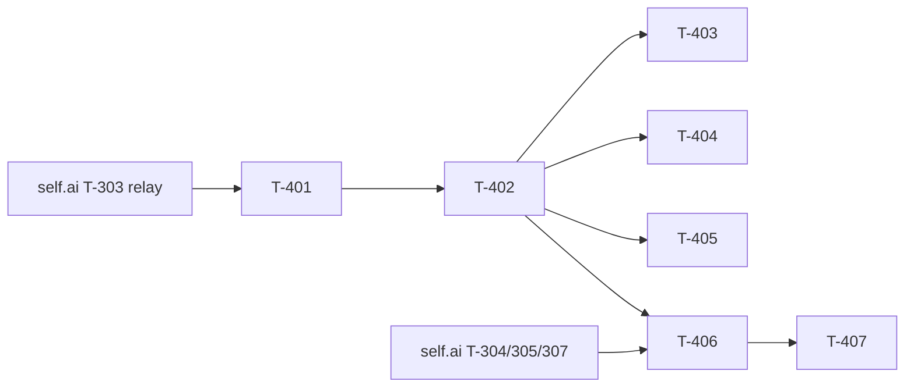

# Build Site: Tokenization Token View (self.chat)

Phase 3 of the Tokenization Studio programme, client half. Renders a reply as
discrete, selectable tokens carrying their own probabilities, and shows the
candidates the model was choosing among at a selected position.

This is the first phase where the surface stops looking like ordinary chat.
Phase 2 delivered a session that behaves exactly like chat; this makes it a
token view.

Decision record: `selfai/gitlab-profile`
`context/treasuremaps/2026-08-11-tokenization-studio.md`, Decision 2 and the
"Alternatives rejected" entry, **as amended by the Phase 1 spike**.

## Source Kit & Requirement Roll-Up

| Kit (short id) | File | In this phase | Deferred |
|---|---|---|---|
| **TV** — Token View | cavekit-tokenization-token-view.md | R1 (8), R2 (7), R3 (7) | R4 → Phase 4 · R5, R6 → Phase 5 · R7 → Phase 8 |

**22 acceptance criteria in scope.** The kit carries 47 across seven
requirements; the four deferred ones are branch-from-token, the pending edit
list, the live preview and the character-strength slider, each of which the
phase table places later and each of which needs backend work this phase does
not build.

## Hard prerequisite

`self.ai`'s `context/plans/build-site-tokenization-logprobs.md` must land
first — **all of it, not just the endpoint**. The client cannot render a
distribution the relay has discarded (T-303 there), and cannot fetch
alternatives from an endpoint that does not exist (T-304).

Nothing in this site is verifiable against today's `main`: the relay reads
exactly `delta.content` and `delta.reasoning_content` and drops everything else,
so a token-bearing consumer built now would parse an empty field forever and
its tests would pass while the feature did nothing.

## Grounding — measured 2026-08-13

### The stream consumer, and why R1 wants a separate one

`src/lib/apis/streaming/index.ts` holds a module-private
`openAIStreamToIterator` (`:72`) that yields a `TextStreamUpdate` (`:4`). Its
body is a chain of `if (…) { yield; continue; }` branches — `error`, `sources`,
`selected_model_id`, `usage`, `reasoning_content` — and only then reads
`choices[0].delta.content`.

**That chain is the problem, and it is subtler than "logprobs are dropped".**
Each `continue` consumes the whole chunk. A chunk carrying reasoning *and*
logprobs yields the reasoning and discards the distribution — silently. The
same is true of the `sources`, `selected_model_id` and `usage` branches. So a
token consumer cannot be a small patch to this function without auditing every
early return; the kit is right that it should be a **separate function** reading
the same SSE, not a flag.

`streamLargeDeltasAsRandomChunks` (`:140`) repeats the same branch structure and
then re-chops content into 1–3 character pieces. Phase 2 already forces it off
for sessions (`splitLargeDeltas={false}`), which is what makes token boundaries
survivable at all — that is a **precondition of this phase**, not a nicety.

### Alternatives are not streamed by default

`Tokenization/constants.ts` sets `DEFAULT_TOP_LOGPROBS = 0`, from the Phase 1
measurement: 968 bytes/token at `top_logprobs=10` (~945 KiB/1000 tokens) versus
~110 KiB/1000 tokens at 0, with alternatives accounting for **92% of payload**.

So R3's "fetched on demand" is not a fallback — **it is the primary path**, and
the streamed case is the exception that occurs only when an artist raises
`top_logprobs` for a session. Build the fetch path first and treat streamed
alternatives as an optimisation that lets the view skip it.

### Pre-sampling, and the field-name trap

The spike reversed the kit's original post-sampling default. Pre-sampling is
now the default, and it changes the wire field names:

| mode | fields |
|---|---|
| pre-sampling (default) | `logprob`, `top_logprobs` |
| post-sampling | `prob`, `top_probs` |

A consumer reading only `top_logprobs` sees **zero alternatives in post mode,
with no error**. R3-AC3 requires the mode be displayed; T-306 requires the
consumer read the right pair for the mode the response declares.

### Rendering

Replies render through `chat/Messages.svelte`, reached from `Chat.svelte:64`.
Per Phase 2's amended R2-AC4, chat components may gain additive optional
configuration but **must not learn what tokenization is** — the token view is
therefore a component of ours, passed in, not a branch inside `Messages`.

## Task Register

Effort: S (<30m), M (30m–2h), L (2h+). Ids T-4xx.

#### T-401: Token-bearing stream consumer
- **Kit:** TV/R1 · **Criteria:** all 8
- **blockedBy:** self.ai T-303
- **Effort:** L
- **Description:** A consumer distinct from `createOpenAITextStream` that yields,
  per chunk, both the text delta and any `choices[0].logprobs.content[]`
  entries. Each retained entry carries at minimum the token **id**, its text,
  its own logprob and its alternatives when present. **Token identity comes from
  `logprobs.content[]`, never from splitting the accumulated string** — delta
  boundaries are chat-parser diffs and are not token boundaries when reasoning
  or tool-call parsing is active.
  Handle the cases the existing iterator's `continue` chain makes easy to get
  wrong: a chunk with a delta and no logprobs must not invent an entry; a chunk
  with logprobs and an **empty** delta must not be dropped; `[DONE]`, errors,
  `sources`, `selected_model_id` and `usage` behave as in the existing consumer.
  `createOpenAITextStream` and `TextStreamUpdate` are unchanged, or changed only
  additively such that normal chat is identical.
- **Files:** `src/lib/apis/streaming/` (new module), or
  `src/lib/components/studio/Tokenization/token-stream.ts`
- **Test Strategy:** Vitest against synthetic SSE fixtures — **including a
  stream where the number of text deltas differs from the number of token
  entries** (R1-AC8), which is the case that proves identity is not derived
  from the string. Assert the normal consumer's output is byte-identical for a
  fixture with no logprobs.

#### T-402: Token rendering
- **Kit:** TV/R2 · **Criteria:** AC1, AC2, AC3, AC6
- **blockedBy:** T-401
- **Effort:** L
- **Description:** Each token renders as a distinct selectable element in
  emission order, **from the token array and not by re-splitting message text**.
  Concatenating the rendered tokens must reproduce the reply exactly, including
  whitespace and leading-space tokens — assert that as an equality, since it is
  the property that makes the view trustworthy at all. Renders **during**
  streaming, not only on completion.
- **Files:** `src/lib/components/studio/Tokenization/TokenView.svelte` (new),
  session page
- **Test Strategy:** Vitest — a round-trip equality test over a fixture
  containing leading-space and multi-byte tokens; a streaming test asserting
  tokens appear before `done`.

#### T-403: Unprintable tokens rendered visibly
- **Kit:** TV/R2 · **Criteria:** R2-AC4
- **blockedBy:** T-402
- **Effort:** M
- **Description:** Whitespace-only, control, and partial multi-byte tokens must
  render **visibly** rather than collapsing to nothing. A token that renders as
  nothing is unselectable, so the artist cannot reweight it — and the ones that
  vanish are exactly the ones that decide formatting and line breaks. The Phase
  1 spike also found control tokens present in the stream that appear in no
  user-visible field (`<|channel>thought\n` was a 3-token prefix), so **do not
  assume every token is renderable text**.
- **Files:** `TokenView.svelte`, a small pure renderer module
- **Test Strategy:** Vitest on the pure renderer — space, newline, tab, a
  control character and a partial multi-byte sequence each produce a non-empty,
  distinguishable rendering.

#### T-404: Confidence conveyed visually
- **Kit:** TV/R2 · **Criteria:** R2-AC5
- **blockedBy:** T-402
- **Effort:** M
- **Description:** A token's own probability is conveyed visually so
  low-confidence regions are findable **without clicking through the reply**.
  This is what `top_logprobs=0` still buys: the chosen token's own logprob comes
  free with the stream, so the heatmap costs no extra payload. Scale must be
  stated somewhere the artist can see — a colour with no legend is a vibe, not a
  measurement.
- **Files:** `TokenView.svelte`, the pure renderer
- **Test Strategy:** Vitest — the mapping from logprob to visual bucket is a
  pure function with boundary tests; assert a legend/scale is rendered.

#### T-405: Long replies stay responsive
- **Kit:** TV/R2 · **Criteria:** R2-AC7
- **blockedBy:** T-402
- **Effort:** M
- **Description:** A reply of **at least 1000 tokens** remains responsive to
  scrolling and selection. 1000 discrete selectable elements each with a colour
  and a click handler is the naive implementation's cliff. Prefer per-token
  handlers delegated to a container over 1000 listeners.
- **Files:** `TokenView.svelte`
- **Test Strategy:** Vitest — render 1000+ tokens and assert one delegated
  handler rather than one per token; a Cypress interaction check on a long
  reply.

#### T-406: Alternatives on selection
- **Kit:** TV/R3 · **Criteria:** AC1, AC2, AC3, AC4
- **blockedBy:** T-402 · **external:** self.ai T-304, T-305, T-307
- **Effort:** L
- **Description:** Selecting a token shows the top-N candidates at that position
  with probabilities, N being the session's `top_logprobs`, and **identifies
  which one the model actually emitted**. Whether the values are pre- or
  post-sampling is **shown, not left ambiguous** — and the consumer must read
  the field pair matching the declared mode (`logprob`/`top_logprobs` versus
  `prob`/`top_probs`), or it will display an empty list with no error.
  Because `DEFAULT_TOP_LOGPROBS = 0`, the on-demand fetch is the **normal**
  path: show a pending state rather than an empty list.
- **Files:** `src/lib/components/studio/Tokenization/Alternatives.svelte` (new),
  an api module for the re-score endpoint
- **Test Strategy:** Vitest — the emitted token is marked within the list; the
  mode is rendered; a post-sampling response yields a populated list (the
  regression guard for the field-name trap); a pending state renders while the
  fetch is outstanding.

#### T-407: Fetch failure, load-waiting and cancellation
- **Kit:** TV/R3 · **Criteria:** AC5, AC6, AC7
- **blockedBy:** T-406
- **Effort:** M
- **Description:** Three states the naive implementation collapses into one
  spinner:
  a **failure** is reported with a reason and is retryable, and must not leave
  the message unreadable; a fetch that requires a **model load** says so rather
  than appearing hung — llamolotl serves one active model, so an older session
  will trigger this, and a load is additionally subject to GPU-window
  enforcement and the VRAM broker, so "waiting" can be legitimately long;
  and selecting a **different token cancels or discards** the pending fetch for
  the previous one, so a slow first response cannot overwrite a newer selection.
- **Files:** `Alternatives.svelte`, the api module
- **Test Strategy:** Vitest — an error renders a reason and a retry; a
  load-required response renders a distinct waiting state; an out-of-order
  resolution does not overwrite the current selection (assert on the discarded
  one specifically).

## Dependency Tiers

### Tier 0 — blocked only on self.ai
| Task | Title | Req | Effort |
|---|---|---|---|
| T-401 | Token-bearing stream consumer | R1 | L |

### Tier 1
| Task | Title | Req | blockedBy | Effort |
|---|---|---|---|---|
| T-402 | Token rendering | R2 | T-401 | L |

### Tier 2
| Task | Title | Req | blockedBy | Effort |
|---|---|---|---|---|
| T-403 | Unprintable tokens visible | R2 | T-402 | M |
| T-404 | Confidence conveyed visually | R2 | T-402 | M |
| T-405 | Long replies responsive | R2 | T-402 | M |
| T-406 | Alternatives on selection | R3 | T-402 + self.ai | L |

### Tier 3
| Task | Title | Req | blockedBy | Effort |
|---|---|---|---|---|
| T-407 | Failure, load-waiting, cancellation | R3 | T-406 | M |

## Dependency Graph

Acyclic. T-402 is the hub; T-403/404/405 are independent of each other and
parallelise well.

## Summary

- **Tasks:** 7 · **Tiers:** 4 · **Effort:** M ×4, L ×3
- **Nothing here is verifiable without the self.ai half.** A token consumer
  built against today's relay would parse an empty field forever and its tests
  would pass while the feature did nothing — the worst available failure.
- **The constraint from Phase 2 still holds:** no chat component may learn what
  tokenization is. The token view is ours, passed in, not a branch inside
  `Messages.svelte`.
- **Phase 2's forced `splitLargeDeltas={false}` is a precondition**, not a
  nicety: with re-chunking on, token boundaries do not survive the stream and
  every requirement here is unbuildable.

## Coverage Matrix

22 acceptance criteria across TV/R1 (8), R2 (7), R3 (7). **Coverage: 22/22 = 100%.**
TV/R4–R7 (25 criteria) are later phases and deliberately unmapped.

| Req | Criterion (abbrev.) | Task |
|---|---|---|
| R1 | Consumer distinct from `createOpenAITextStream` | T-401 |
| R1 | `createOpenAITextStream`/`TextStreamUpdate` unchanged or additive | T-401 |
| R1 | Entries carry id, text, own logprob, alternatives | T-401 |
| R1 | Boundaries never derived from accumulated content | T-401 |
| R1 | Delta without logprobs invents no entry | T-401 |
| R1 | Logprobs with empty delta not dropped | T-401 |
| R1 | `[DONE]`/error/sources/model-id/usage handled as before | T-401 |
| R1 | Test: delta count differs from token count | T-401 |
| R2 | Each token a distinct selectable element, in order | T-402 |
| R2 | Concatenation reproduces the reply exactly | T-402 |
| R2 | Rendered from the token array, not re-split text | T-402 |
| R2 | Unprintable tokens rendered visibly | T-403 |
| R2 | Own probability conveyed visually | T-404 |
| R2 | Renders during streaming, not only after | T-402 |
| R2 | 1000+ tokens responsive to scroll and selection | T-405 |
| R3 | Top-N alternatives with probabilities on selection | T-406 |
| R3 | The emitted token identified within the list | T-406 |
| R3 | Pre/post-sampling shown, not ambiguous | T-406 |
| R3 | Fetched on demand with a pending state | T-406 |
| R3 | Failure reported with a reason, retryable | T-407 |
| R3 | Model-load wait reported, not apparently hung | T-407 |
| R3 | Selecting another token cancels the pending fetch | T-407 |
